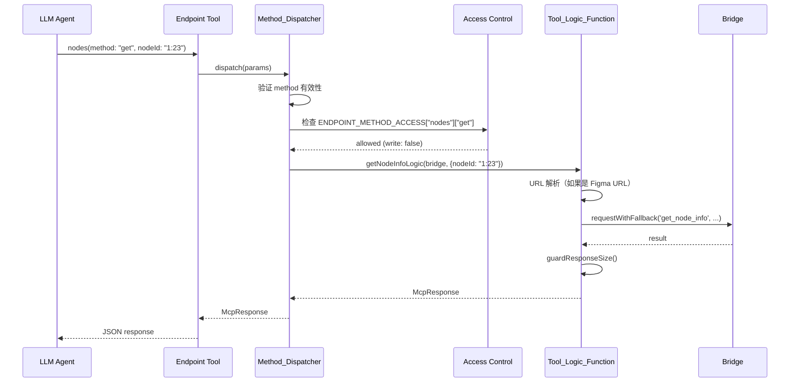

# 技术设计文档：Endpoint 模式重构

## 概述

本设计将 FigCraft MCP Server 的工具架构从扁平模式（~117 个独立工具）重构为 endpoint 模式（资源导向 API + 方法分发）。核心目标：

1. **降低 LLM 认知负担**：将 ~33 个核心工具压缩为 ~20 个（4 个 endpoint + ~16 个 standalone）
2. **资源导向心智模型**：`nodes(method: "get", nodeId: "1:23")` 替代 `get_node_info(nodeId: "1:23")`
3. **渐进式迁移**：三阶段推进（共存 → 废弃 → 移除），通过 `FIGCRAFT_API_MODE` 环境变量控制

关键设计决策：
- Endpoint 工具通过 Method_Dispatcher 路由到 Tool_Logic_Function，而非直接调用 `bridge.request()`，以保留 URL 解析、REST fallback、response guard 等业务逻辑
- Endpoint 工具本身不标记为 write tool，访问控制在 method 粒度执行
- `create_document` 保持为 standalone tool，`nodes` endpoint 不包含 `create` method

## 架构

### 当前架构

```mermaid
graph TD
    YAML[schema/tools.yaml] -->|compile-schema.ts| REG[_registry.ts<br/>CORE_TOOLS, TOOLSETS, WRITE_TOOLS]
    YAML -->|compile-schema.ts| GEN[_generated.ts<br/>bridge tool registrations]
    
    REG --> TM[toolset-manager.ts<br/>enable/disable tools]
    GEN --> TM
    
    CUSTOM[Custom tools<br/>nodes.ts, mode.ts, export.ts...] --> TM
    TM --> SERVER[McpServer<br/>server.tool() registrations]
    SERVER -->|stdio| IDE[IDE / LLM Agent]
    SERVER -->|bridge.request()| BRIDGE[Bridge<br/>WebSocket]
    BRIDGE --> RELAY[WS Relay :3055]
    RELAY --> PLUGIN[Figma Plugin<br/>handlers/]
```

### 重构后架构

```mermaid
graph TD
    YAML[schema/tools.yaml<br/>+ handler: endpoint] -->|compile-schema.ts| REG[_registry.ts<br/>+ ENDPOINT_METHOD_ACCESS]
    YAML -->|compile-schema.ts| GEN[_generated.ts<br/>+ endpoint Zod schemas]
    
    TLF[Tool_Logic_Functions<br/>node-logic.ts, mode-logic.ts...] --> DISP
    
    REG --> TM[toolset-manager.ts<br/>+ FIGCRAFT_API_MODE]
    GEN --> TM
    
    DISP[Method_Dispatcher<br/>endpoints.ts] --> TM
    FLAT[Flat tools<br/>nodes.ts, mode.ts...] --> TM
    FLAT -.->|调用| TLF
    DISP -.->|调用| TLF
    
    TM --> SERVER[McpServer]
    SERVER -->|stdio| IDE[IDE / LLM Agent]
    TLF -->|bridge.request()| BRIDGE[Bridge]
    BRIDGE --> RELAY[WS Relay]
    RELAY --> PLUGIN[Figma Plugin<br/>handlers/ 不修改]
```

### 关键架构决策

| 决策 | 选择 | 理由 |
|------|------|------|
| Tool_Logic_Function 提取层级 | 提取为独立 async 函数，接受 `(bridge, params, extra?)` | 最小改动，flat tool 和 endpoint 均可调用 |
| Method_Dispatcher 实现位置 | `src/mcp-server/tools/endpoints.ts` | 已有部分实现（helpers），集中管理所有 endpoint |
| Endpoint 参数 schema 生成 | Schema_Compiler 自动合并各 method 参数为 union | 避免手写，保持 YAML 为单一真相源 |
| `create_document` 归属 | Standalone tool，不纳入任何 endpoint | 避免与 `nodes` endpoint 产生选择困惑 |
| 访问控制粒度 | Method 级别，通过 `GENERATED_ENDPOINT_METHOD_ACCESS` | Endpoint 同时包含 read/write method，不能整体标记 |
| Phase 1 默认模式 | `FIGCRAFT_API_MODE=flat`（向后兼容） | 确保现有用户不受影响 |


## 组件与接口

### 1. Tool_Logic_Functions（核心逻辑层）

从现有 custom tool 的 `server.tool()` 回调中提取的独立可复用函数。每个函数封装完整的业务逻辑（URL 解析、REST fallback、response guard 等），返回 MCP 标准响应格式。

#### 文件组织

新建 `src/mcp-server/tools/logic/` 目录，按功能域拆分：

| 文件 | 导出函数 | 提取自 | 关键逻辑 |
|------|---------|--------|---------|
| `node-logic.ts` | `getNodeInfoLogic()` | `nodes.ts` → `get_node_info` | Figma URL 解析（`figma.com/` 检测 → 提取 fileKey + nodeId）、`requestWithFallback()` REST fallback、`Bridge.guardResponseSize()`、node-not-found 工作流引导 |
| `node-logic.ts` | `getCurrentPageLogic()` | `nodes.ts` → `get_current_page` | `Bridge.guardResponseSize()`、workflow hint（"⚡ NEXT: If creating elements..."） |
| `node-logic.ts` | `searchNodesLogic()` | `nodes.ts` → `search_nodes` | `Bridge.guardResponseSize()` |
| `mode-logic.ts` | `getModeLogic()` | `mode.ts` → `get_mode` | 内置 ping、version check、`fetchLibraryComponents()`、`_hint` 注入、fileContext 缓存 |
| `write-node-logic.ts` | `createDocumentLogic()` | `write-nodes.ts` → `create_document` | 递归 type 校验（`validateNodeSpecs`）、节点计数、progress notification（`extra._meta.progressToken`）、120s 超时、lint hint 生成 |
| `export-logic.ts` | `exportImageLogic()` | `export.ts` → `export_image` | `requestWithFallback()` REST fallback |

#### 函数签名规范

```typescript
// 标准 Tool_Logic_Function 签名
type McpResponse = { content: Array<{ type: 'text'; text: string }>; isError?: boolean };

// 基础签名（大多数函数）
type ToolLogicFn = (
  bridge: Bridge,
  params: Record<string, unknown>,
) => Promise<McpResponse>;

// 需要 extra 上下文的签名（create_document 需要 progressToken）
type ToolLogicFnWithExtra = (
  bridge: Bridge,
  params: Record<string, unknown>,
  extra?: { _meta?: { progressToken?: unknown }; sendNotification?: Function },
) => Promise<McpResponse>;
```

#### 提取示例：`getNodeInfoLogic`

```typescript
// src/mcp-server/tools/logic/node-logic.ts
export async function getNodeInfoLogic(
  bridge: Bridge,
  params: { nodeId: string },
): Promise<McpResponse> {
  let resolvedNodeId = params.nodeId;
  
  // Figma URL 解析逻辑（原封不动从 nodes.ts 提取）
  if (resolvedNodeId.includes('figma.com/')) {
    const urlFileKey = extractFileKeyFromUrl(resolvedNodeId);
    const urlNodeId = extractNodeIdFromUrl(resolvedNodeId);
    if (urlFileKey) setFileKey(urlFileKey);
    if (urlNodeId) {
      resolvedNodeId = urlNodeId;
    } else {
      return { content: [{ type: 'text', text: 'Could not extract node ID...' }] };
    }
  }

  // REST fallback
  const { result, source } = await requestWithFallback(
    bridge, 'get_node_info', { nodeId: resolvedNodeId },
    () => restGetNodeInfo(resolvedNodeId),
  );

  // Node-not-found 引导
  const resultObj = result as Record<string, unknown>;
  if (resultObj?.error && String(resultObj.error).includes('not found')) {
    return {
      content: [
        { type: 'text', text: JSON.stringify(result, null, 2) },
        { type: 'text', text: '\n⚠️ Node not found...' },
      ],
    };
  }

  // Response guard
  const guarded = Bridge.guardResponseSize(result, 'get_node_info', [...]);
  const text = source === 'rest-api'
    ? JSON.stringify(guarded, null, 2) + '\n\n⚠️ Data from REST API...'
    : JSON.stringify(guarded, null, 2);
  return { content: [{ type: 'text', text }] };
}
```

提取后，原有 flat tool 改为：

```typescript
// nodes.ts（修改后）
server.tool('get_node_info', description, schema, async ({ nodeId }) => {
  return getNodeInfoLogic(bridge, { nodeId });
});
```

### 2. Schema 格式扩展（`schema/tools.yaml`）

#### Endpoint 定义格式

```yaml
# 新增 handler: endpoint 类型
nodes:
  description: >-
    Node operations — get, list, update, delete, clone, insert_child.
    For creating nodes, use create_document (batch) or shapes/text endpoints.
  toolset: core
  handler: endpoint
  methods:
    get:
      description: Get detailed node info by ID (supports Figma URLs)
      maps_to: get_node_info
      write: false
      params:
        nodeId:
          type: string
          required: true
          description: 'Node ID or Figma URL'
    list:
      description: Search nodes by name, optionally filter by type
      maps_to: search_nodes
      write: false
      params:
        query:
          type: string
          required: true
          description: Search query
        types:
          type: array
          items: string
          description: Filter by node types
        limit:
          type: number
          description: Max results (default 50)
    update:
      description: Update properties on one or more nodes
      maps_to: patch_nodes
      write: true
      access: edit
      params:
        patches:
          type: array
          required: true
          items:
            type: object
            fields:
              nodeId:
                type: string
                required: true
              props:
                type: record
                required: true
                valueType: unknown
    delete:
      description: Delete nodes by ID
      maps_to: delete_nodes
      write: true
      access: edit
      params:
        nodeIds:
          type: array
          required: true
          items: string
    clone:
      description: Clone a node
      maps_to: clone_node
      write: true
      access: create
      params:
        nodeId:
          type: string
          required: true
    insert_child:
      description: Move a node into a parent container
      maps_to: insert_child
      write: true
      access: edit
      params:
        parentId:
          type: string
          required: true
        childId:
          type: string
          required: true
        index:
          type: number
```

#### Schema_Compiler 生成逻辑

Schema_Compiler 对 `handler: endpoint` 工具执行以下生成：

1. **Zod Schema 合并**：`method` 为 required 枚举（值 = 所有 method 名），其余参数取各 method 参数的并集，全部标记为 optional。同名参数类型冲突时使用 `z.union()`。

2. **`GENERATED_ENDPOINT_METHOD_ACCESS` 映射表**：

```typescript
// _registry.ts 中生成
export const GENERATED_ENDPOINT_METHOD_ACCESS: Record<
  string,
  Record<string, { write: boolean; access?: 'create' | 'edit' }>
> = {
  nodes: {
    get: { write: false },
    list: { write: false },
    update: { write: true, access: 'edit' },
    delete: { write: true, access: 'edit' },
    clone: { write: true, access: 'create' },
    insert_child: { write: true, access: 'edit' },
  },
  text: {
    create: { write: true, access: 'create' },
    set_content: { write: true, access: 'edit' },
  },
  // ... 其他 endpoint
};
```

3. **Endpoint 工具不加入 `GENERATED_WRITE_TOOLS`**：因为 endpoint 同时包含 read 和 write method。

### 3. Method_Dispatcher（方法分发器）

位于 `src/mcp-server/tools/endpoints.ts`，负责：

1. 解析 `method` 参数
2. 查询 `GENERATED_ENDPOINT_METHOD_ACCESS` 进行 method 级别权限检查
3. 路由到对应的 Tool_Logic_Function 或 `bridge.request()`

```typescript
// endpoints.ts 核心结构
import { GENERATED_ENDPOINT_METHOD_ACCESS } from './_registry.js';
import { isToolBlocked, getAccessLevel } from './toolset-manager.js';

type MethodHandler = (
  bridge: Bridge,
  params: Record<string, unknown>,
  extra?: unknown,
) => Promise<McpResponse>;

interface EndpointConfig {
  name: string;
  methods: Record<string, MethodHandler>;
}

function createMethodDispatcher(
  config: EndpointConfig,
  bridge: Bridge,
) {
  return async (params: Record<string, unknown>, extra?: unknown) => {
    const method = params.method as string;
    
    // 1. 验证 method 有效性
    if (!config.methods[method]) {
      return errorResponse(
        `Unknown method "${method}" for endpoint "${config.name}". ` +
        `Available methods: ${Object.keys(config.methods).join(', ')}`
      );
    }
    
    // 2. Method 级别权限检查
    const methodAccess = GENERATED_ENDPOINT_METHOD_ACCESS[config.name]?.[method];
    if (methodAccess?.write) {
      const accessLevel = getAccessLevel();
      const methodAccessLevel = methodAccess.access ?? 'edit';
      
      if (accessLevel === 'read') {
        const readMethods = Object.entries(GENERATED_ENDPOINT_METHOD_ACCESS[config.name])
          .filter(([, v]) => !v.write)
          .map(([k]) => k);
        return errorResponse(
          `Method "${method}" blocked by FIGCRAFT_ACCESS=read. ` +
          `Available read methods: ${readMethods.join(', ')}`
        );
      }
      
      if (accessLevel === 'create' && methodAccessLevel === 'edit') {
        const allowedMethods = Object.entries(GENERATED_ENDPOINT_METHOD_ACCESS[config.name])
          .filter(([, v]) => !v.write || v.access === 'create')
          .map(([k]) => k);
        return errorResponse(
          `Method "${method}" blocked by FIGCRAFT_ACCESS=create. ` +
          `Available methods: ${allowedMethods.join(', ')}`
        );
      }
    }
    
    // 3. 路由到 handler
    const handler = config.methods[method];
    return handler(bridge, params, extra);
  };
}
```

### 4. Endpoint 工具注册

每个 endpoint 在 `endpoints.ts` 中通过 `server.tool()` 注册，使用 Schema_Compiler 生成的 Zod schema：

```typescript
export function registerEndpointTools(server: McpServer, bridge: Bridge): void {
  // nodes endpoint
  const nodesDispatcher = createMethodDispatcher({
    name: 'nodes',
    methods: {
      get: (b, p) => getNodeInfoLogic(b, { nodeId: p.nodeId as string }),
      list: (b, p) => searchNodesLogic(b, {
        query: p.query as string,
        types: p.types as string[] | undefined,
        limit: p.limit as number | undefined,
      }),
      update: (b, p) => bridgeRequestLogic(b, 'patch_nodes', { patches: p.patches }),
      delete: (b, p) => bridgeRequestLogic(b, 'delete_nodes', { nodeIds: p.nodeIds }),
      clone: (b, p) => bridgeRequestLogic(b, 'clone_node', { nodeId: p.nodeId }),
      insert_child: (b, p) => bridgeRequestLogic(b, 'insert_child', {
        parentId: p.parentId, childId: p.childId, index: p.index,
      }),
    },
  }, bridge);

  server.tool('nodes', nodesDescription, nodesZodSchema, nodesDispatcher);
  // ... 其他 endpoint 类似
}
```

### 5. Toolset_Manager 适配

#### `FIGCRAFT_API_MODE` 环境变量

```typescript
type ApiMode = 'endpoint' | 'flat' | 'both';

function resolveApiMode(): ApiMode {
  const mode = (process.env.FIGCRAFT_API_MODE ?? 'flat').toLowerCase();
  if (mode === 'endpoint' || mode === 'flat' || mode === 'both') return mode as ApiMode;
  console.error(`[FigCraft] WARNING: unknown FIGCRAFT_API_MODE="${mode}", defaulting to "flat"`);
  return 'flat';
}
```

#### 模式行为

| 模式 | 行为 |
|------|------|
| `flat`（默认） | 禁用所有 endpoint 工具，保持当前行为 |
| `endpoint` | 禁用被 endpoint 替代的 flat tool，启用 endpoint + standalone |
| `both` | 两套 API 共存，均可使用 |

#### `load_toolset` 适配

当 `load_toolset("variables")` 被调用时：
- `flat` 模式：启用 18 个 flat variable tools（当前行为）
- `endpoint` 模式：启用 `variables` endpoint tool（1 个工具，12 个 method）
- `both` 模式：同时启用两者

#### `list_toolsets` 输出增强

endpoint 模式下显示：
```
API mode: endpoint
Core tools (always enabled): 20
  Endpoints: nodes (6 methods), text (2 methods), shapes (4 methods), components (5 methods)
  Standalone: ping, get_mode, set_mode, create_document, ...

Available toolsets:
  variables (1 endpoint, 12 methods) [⬚ not loaded]
  styles (1 endpoint, 8 methods) [⬚ not loaded]
  ...
```

### 6. Endpoint 与 Flat Tool 映射关系

#### `nodes` endpoint（核心）

| Method | 映射到 | write | access |
|--------|--------|-------|--------|
| `get` | `get_node_info` → `getNodeInfoLogic()` | false | — |
| `list` | `search_nodes` → `searchNodesLogic()` | false | — |
| `update` | `patch_nodes` → `bridge.request()` | true | edit |
| `delete` | `delete_nodes` → `bridge.request()` | true | edit |
| `clone` | `clone_node` → `bridge.request()` | true | create |
| `insert_child` | `insert_child` → `bridge.request()` | true | edit |

#### `text` endpoint（核心）

| Method | 映射到 | write | access |
|--------|--------|-------|--------|
| `create` | `create_text` → `bridge.request()` | true | create |
| `set_content` | `set_text_content` → `bridge.request()` | true | edit |

#### `shapes` endpoint（核心）

| Method | 映射到 | write | access |
|--------|--------|-------|--------|
| `create_frame` | `create_frame` → `bridge.request()` | true | create |
| `create_rectangle` | `create_rectangle` → `bridge.request()` | true | create |
| `create_ellipse` | `create_ellipse` → `bridge.request()` | true | create |
| `create_vector` | `create_vector` → `bridge.request()` | true | create |

#### `components` endpoint（核心 + toolset 扩展）

核心 method（始终可用）：

| Method | 映射到 | write | access |
|--------|--------|-------|--------|
| `list` | `list_components` → `bridge.request()` | false | — |
| `list_library` | `list_library_components` → custom logic | false | — |
| `get` | `get_component` → `bridge.request()` | false | — |
| `create_instance` | `create_instance` → `bridge.request()` | true | create |
| `list_properties` | `list_component_properties` → `bridge.request()` | false | — |

Toolset 扩展 method（需 `load_toolset("components-advanced")`）：

| Method | 映射到 | write | access |
|--------|--------|-------|--------|
| `create` | `create_component` → `bridge.request()` | true | create |
| `update` | `update_component` → `bridge.request()` | true | edit |
| `delete` | `delete_component` → `bridge.request()` | true | edit |
| `swap` | `swap_instance` → `bridge.request()` | true | edit |
| `detach` | `detach_instance` → `bridge.request()` | true | edit |
| `audit` | `audit_components` → `bridge.request()` | false | — |

#### `variables` endpoint（toolset）

需 `load_toolset("variables")` 启用，12 个 method。

#### `styles` endpoint（toolset）

需 `load_toolset("styles")` 启用，8 个 method。

#### Standalone Tools（保持不变）

`ping`、`get_mode`、`set_mode`、`create_document`、`join_channel`、`get_channel`、`export_image`、`lint_fix_all`、`set_current_page`、`save_version_history`、`set_selection`、`get_selection`、`get_current_page`、`get_document_info`、`list_fonts`、`set_image_fill`

#### 保持为 Flat Tool 的 Toolset

`tokens`（11 tools）、`library`（7 tools）、`annotations`（6 tools）、`lint`（4 tools）、`auth`（3 tools）、`pages`（3 tools）、`shapes-vectors` 中的非核心工具（6 tools）

### 7. Phase 2/3 废弃与移除机制

#### Phase 2：废弃标记

```yaml
# schema/tools.yaml 中添加
get_node_info:
  deprecated: true
  replaced_by: nodes.get
  # ... 原有定义不变
```

Schema_Compiler 在 Phase 2 自动：
- 在 description 前添加 `[DEPRECATED] Use nodes(method: "get") instead. `
- 生成 `GENERATED_DEPRECATED_TOOLS` 映射表

运行时，被废弃工具的响应附加 deprecation 警告：
```json
{
  "_deprecation": {
    "warning": "This tool is deprecated. Use nodes(method: \"get\") instead.",
    "replacement": "nodes.get"
  }
}
```

#### Phase 3：移除

移除 flat tool 定义后，Schema_Compiler 生成 `GENERATED_REMOVED_TOOLS` 映射表。运行时对已移除工具名返回迁移指引错误。

### 8. 跨文件注册一致性修复

**问题**：`get_reactions` 在 `nodes.ts` 中注册，但 `schema/tools.yaml` 中属于 `annotations` toolset。

**修复**：将 `get_reactions` 的 `server.tool()` 注册从 `nodes.ts` 移至 `annotations.ts`。

**Schema_Compiler 增强**：编译时输出 warning，检查 `handler: custom` 工具的 toolset 归属与注册文件是否一致（基于约定：toolset 名 → 注册文件名映射）。


## 数据模型

### Schema 定义扩展

`schema/tools.yaml` 新增 `handler: endpoint` 类型的 ToolDef：

```typescript
interface EndpointMethodDef {
  description: string;
  maps_to: string;           // 原始 flat tool 名称
  write: boolean;
  access?: 'create' | 'edit';
  params: Record<string, ParamDef>;
}

interface EndpointToolDef {
  description: string;
  toolset: string;
  handler: 'endpoint';
  methods: Record<string, EndpointMethodDef>;
}
```

### 生成的注册表数据结构

```typescript
// _registry.ts 新增导出

/** Endpoint method 级别访问控制映射 */
export const GENERATED_ENDPOINT_METHOD_ACCESS: Record<
  string,  // endpoint 名
  Record<string, {  // method 名
    write: boolean;
    access?: 'create' | 'edit';
  }>
> = { /* ... */ };

/** Endpoint 工具集合（用于 API 模式切换） */
export const GENERATED_ENDPOINT_TOOLS = new Set<string>([
  'nodes', 'text', 'shapes', 'components', 'variables', 'styles',
]);

/** Flat tool → endpoint.method 替代映射（用于 Phase 2 废弃提示） */
export const GENERATED_DEPRECATED_TOOLS: Record<string, {
  replacedBy: string;  // 格式: "endpoint.method"
}> = { /* ... */ };

/** Endpoint → 被替代的 flat tool 列表（用于 API 模式切换） */
export const GENERATED_ENDPOINT_REPLACES: Record<string, string[]> = {
  nodes: ['get_node_info', 'search_nodes', 'patch_nodes', 'delete_nodes', 'clone_node', 'insert_child'],
  text: ['create_text', 'set_text_content'],
  shapes: ['create_frame', 'create_rectangle', 'create_ellipse', 'create_vector'],
  components: ['list_components', 'list_library_components', 'get_component', 'create_instance', 'list_component_properties'],
  // toolset endpoints...
};
```

### API 模式配置

```typescript
// 环境变量
FIGCRAFT_API_MODE = 'flat' | 'endpoint' | 'both'  // 默认: flat

// 运行时状态
interface ApiModeState {
  mode: ApiMode;
  activeEndpoints: Set<string>;     // 当前启用的 endpoint 工具
  disabledFlatTools: Set<string>;   // 被 endpoint 替代而禁用的 flat tool
}
```

### Method_Dispatcher 内部数据流



### `create_document` 的 extra 参数传递

`createDocumentLogic()` 需要 `extra._meta.progressToken` 和 `extra.sendNotification`。由于 `create_document` 保持为 standalone tool，这些参数直接从 `server.tool()` 回调的 `extra` 参数传入：

```typescript
// write-nodes.ts（修改后）
server.tool('create_document', desc, schema, async ({ parentId, nodes }, extra) => {
  return createDocumentLogic(bridge, { parentId, nodes }, extra);
});
```

如果未来某个 endpoint method 也需要 `extra`，Method_Dispatcher 会将 `extra` 透传给 Tool_Logic_Function。


## 正确性属性（Correctness Properties）

*属性（property）是在系统所有有效执行中都应成立的特征或行为——本质上是对系统应做什么的形式化陈述。属性是人类可读规范与机器可验证正确性保证之间的桥梁。*

### Property 1: Endpoint 与 Flat Tool 行为等价

*For any* 有效的工具操作参数，通过 endpoint 方法调用（如 `nodes(method: "get", nodeId: X)`）和通过对应的 flat tool 调用（如 `get_node_info(nodeId: X)`）应产生相同的 Bridge 请求参数和响应格式，因为两者调用同一个 Tool_Logic_Function。

**Validates: Requirements 1.1, 1.3, 6.2, 12.2**

### Property 2: Tool_Logic_Function 返回格式一致性

*For any* Tool_Logic_Function 和任意有效输入参数，函数返回值必须符合 MCP 标准响应格式 `{ content: Array<{ type: 'text'; text: string }>; isError?: boolean }`。对于简单的 bridge handler method，`bridge.request()` 的结果必须被包装为此格式。

**Validates: Requirements 1.2, 3.5**

### Property 3: Schema_Compiler Endpoint 参数合并正确性

*For any* endpoint 定义（包含 N 个 method，每个 method 有各自的参数集），Schema_Compiler 生成的 Zod schema 应满足：`method` 为 required 枚举（值集合 = 所有 method 名），其余参数为各 method 参数的并集且全部标记为 optional。同名参数类型不同时使用 `z.union()` 合并。

**Validates: Requirements 2.2, 2.3**

### Property 4: Endpoint 注册表正确性

*For any* endpoint 工具定义，Schema_Compiler 生成的 `_registry.ts` 应满足两个不变量：(a) endpoint 工具名出现在其 `toolset` 对应的集合中（core 或 toolset），(b) endpoint 工具名不出现在 `GENERATED_WRITE_TOOLS` 中。

**Validates: Requirements 2.4, 5.5**

### Property 5: ENDPOINT_METHOD_ACCESS 映射完整性

*For any* endpoint 定义中的每个 method，`GENERATED_ENDPOINT_METHOD_ACCESS` 映射表应包含该 method 的条目，且 `write` 和 `access` 字段与 YAML 定义一致。

**Validates: Requirements 2.5, 5.6**

### Property 6: Schema_Compiler 对无效 Endpoint 定义的拒绝

*For any* 缺少必要字段（`methods` 或 `description`）的 endpoint 工具定义，Schema_Compiler 应输出包含具体缺失字段名的错误信息并终止编译（非零退出码）。

**Validates: Requirements 2.6**

### Property 7: Method_Dispatcher 路由正确性

*For any* endpoint 和任意有效 method 名，Method_Dispatcher 应将请求路由到该 method 对应的 Tool_Logic_Function 或 bridge handler。

**Validates: Requirements 3.1**

### Property 8: Method_Dispatcher 对无效 Method 的拒绝

*For any* endpoint 和任意不在该 endpoint 支持列表中的 method 字符串，Method_Dispatcher 应返回包含所有有效 method 名列表的错误响应。

**Validates: Requirements 3.2**

### Property 9: Method 级别访问控制

*For any* (endpoint, method, accessLevel) 三元组，Method_Dispatcher 的允许/拒绝行为应满足：
- `accessLevel=read` 时：仅允许 `write: false` 的 method
- `accessLevel=create` 时：允许 `write: false` 和 `access: create` 的 method，拒绝 `access: edit` 的 method
- `accessLevel=edit` 时：允许所有 method

被拒绝时，错误响应应包含当前访问级别、被阻止的 method 名、以及该 endpoint 中当前级别下可用的 method 列表。

**Validates: Requirements 3.4, 5.1, 5.2, 5.3, 5.4**

### Property 10: API 模式工具启用/禁用正确性

*For any* `FIGCRAFT_API_MODE` 值和任意工具名：
- `flat` 模式：所有 endpoint 工具被禁用，所有 flat tool 保持启用
- `endpoint` 模式：被 endpoint 替代的 flat tool 被禁用，endpoint 工具和 standalone 工具启用
- `both` 模式：endpoint 工具和 flat tool 均启用

**Validates: Requirements 6.4, 6.5**

### Property 11: load_toolset 模式感知

*For any* toolset 名和任意 `FIGCRAFT_API_MODE`，`load_toolset` 应根据当前模式启用正确的工具集：flat 模式启用 flat tools，endpoint 模式启用 endpoint tool，both 模式启用两者。

**Validates: Requirements 7.2**

### Property 12: 注册文件与 Toolset 归属一致性

*For any* `handler: custom` 的工具，其在 `schema/tools.yaml` 中的 `toolset` 归属应与其实际注册的 TypeScript 文件一致（基于 toolset 名 → 注册文件名的约定映射）。

**Validates: Requirements 9.2**

### Property 13: 废弃工具标记与警告

*For any* 标记为 `deprecated: true` 的工具：(a) 其 description 应以 `[DEPRECATED]` 前缀开头，(b) 调用该工具时响应应包含 `_deprecation` 字段，其中包含 `replaced_by` 指向的 endpoint.method 信息。

**Validates: Requirements 10.1, 10.2, 10.3**

### Property 14: 已移除工具的迁移指引

*For any* 已从 schema 中移除的 flat 工具名称，当外部系统尝试调用时，MCP_Server 应返回包含对应 endpoint 工具名和 method 名的迁移指引错误响应。

**Validates: Requirements 11.3**


## 错误处理

### Method_Dispatcher 错误

| 错误场景 | 响应格式 | HTTP-like 语义 |
|---------|---------|---------------|
| 无效 method | `{ ok: false, error: "Unknown method ...", availableMethods: [...] }` | 400 |
| 访问控制阻止 | `{ ok: false, error: "Method ... blocked by FIGCRAFT_ACCESS=...", accessLevel: "...", allowedMethods: [...] }` | 403 |
| Tool_Logic_Function 内部错误 | 透传原始错误响应 | 500 |

### Schema_Compiler 错误

| 错误场景 | 行为 |
|---------|------|
| endpoint 缺少 `methods` 字段 | 输出 `ERROR: endpoint "X" missing required field "methods"` 并 `process.exit(1)` |
| endpoint 缺少 `description` 字段 | 输出 `ERROR: endpoint "X" missing required field "description"` 并 `process.exit(1)` |
| method 缺少 `maps_to` 字段 | 输出 `WARNING: endpoint "X" method "Y" missing "maps_to"` |
| `handler: custom` 工具注册文件不一致 | 输出 `WARNING: tool "X" (toolset: Y) may be registered in wrong file` |

### API 模式错误

| 错误场景 | 行为 |
|---------|------|
| `FIGCRAFT_API_MODE` 值无效 | 输出 warning，回退到 `flat` 模式 |
| endpoint 模式下调用被禁用的 flat tool | MCP SDK 返回 tool not found（标准行为） |
| flat 模式下调用 endpoint tool | MCP SDK 返回 tool not found（标准行为） |

### Phase 2/3 废弃与移除错误

| 错误场景 | 响应格式 |
|---------|---------|
| 调用 deprecated flat tool | 正常执行 + 附加 `_deprecation` 警告 |
| 调用 removed flat tool（Phase 3） | `{ ok: false, error: "Tool X has been removed. Use endpoint(method: Y) instead.", migration: { endpoint: "...", method: "..." } }` |

### Tool_Logic_Function 错误传播

Tool_Logic_Function 内部的错误（如 bridge 超时、REST fallback 失败）保持原有行为不变。Method_Dispatcher 透传 Tool_Logic_Function 的完整响应，不做额外包装。

## 测试策略

### 双轨测试方法

本项目采用单元测试 + 属性测试的双轨方法：

- **单元测试**：验证具体示例、边界情况、错误条件
- **属性测试**：验证跨所有输入的通用属性

两者互补，缺一不可。

### 属性测试配置

- **库**：使用 [fast-check](https://github.com/dubzzz/fast-check)（TypeScript 生态最成熟的 PBT 库）
- **每个属性测试最少 100 次迭代**
- **每个属性测试必须引用设计文档中的属性编号**
- **标签格式**：`Feature: endpoint-mode-refactor, Property {number}: {property_text}`

### 测试文件组织

| 测试文件 | 覆盖范围 |
|---------|---------|
| `tests/tool-logic.test.ts` | Tool_Logic_Function 提取后的行为等价性（Property 1, 2） |
| `tests/schema-compiler-endpoint.test.ts` | Schema_Compiler 对 endpoint 定义的编译正确性（Property 3, 4, 5, 6） |
| `tests/method-dispatcher.test.ts` | Method_Dispatcher 路由、无效 method 拒绝、参数转换（Property 7, 8） |
| `tests/endpoint-access-control.test.ts` | Method 级别访问控制（Property 9） |
| `tests/api-mode.test.ts` | FIGCRAFT_API_MODE 三种模式的工具启用/禁用（Property 10, 11） |
| `tests/access-control.test.ts` | 扩展现有测试，新增 endpoint 模式用例（保留原有 flat tool 测试） |
| `tests/registration-consistency.test.ts` | 注册文件与 toolset 归属一致性（Property 12） |
| `tests/deprecation.test.ts` | 废弃标记与迁移指引（Property 13, 14） |

### 单元测试重点

- 每个 endpoint 的每个 method 的参数转换和路由正确性
- `get_reactions` 从 `nodes.ts` 移至 `annotations.ts` 后的功能正确性
- `FIGCRAFT_API_MODE` 三种模式下的启动行为
- Schema_Compiler 对各种 endpoint 定义（正常/异常）的编译输出
- Phase 2 deprecated 工具的 description 前缀和响应警告
- Phase 3 removed 工具的迁移指引错误响应

### 属性测试重点

每个正确性属性对应一个属性测试：

- **Property 1**（行为等价）：生成随机有效参数，分别通过 endpoint 和 flat tool 调用，断言结果相同
- **Property 3**（参数合并）：生成随机 endpoint method 定义，验证合并后的 Zod schema 结构
- **Property 5**（映射完整性）：生成随机 endpoint 定义，验证 ENDPOINT_METHOD_ACCESS 包含所有 method
- **Property 9**（访问控制）：生成随机 (endpoint, method, accessLevel) 三元组，验证允许/拒绝行为
- **Property 10**（API 模式）：生成随机 API 模式和工具名，验证启用/禁用状态

### 回归保障

- 所有现有 232 个测试在 `FIGCRAFT_API_MODE=flat` 下必须继续通过
- CI 中新增 `FIGCRAFT_API_MODE=endpoint` 和 `FIGCRAFT_API_MODE=both` 的测试矩阵
- Schema_Compiler 测试确保现有 flat tool 定义的编译输出不变

