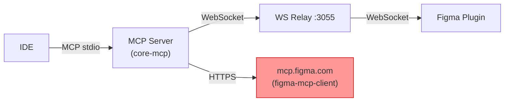
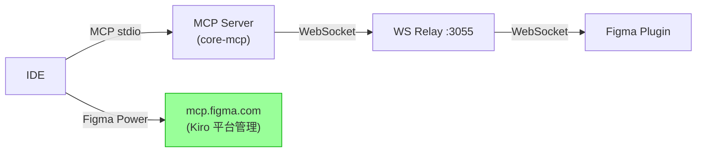
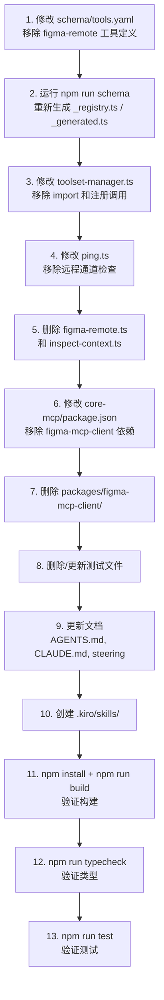

# 设计文档：Figma Skills 集成（移除 Remote 通道代理）

## 概述

本设计描述如何将 FigCraft 从双通道架构（Plugin 通道 + Remote 通道）迁移到单通道架构（仅 Plugin 通道），移除自建的 Remote 通道代理层，让 Figma Power（Kiro 平台提供的 Figma 集成能力包）接管所有远程通道功能。同时导入 Figma 官方 Skills 作为 Kiro Skills，补充 AI 引导能力。

核心变更：
- 删除 `packages/figma-mcp-client/` 包（Streamable HTTP 客户端）
- 删除 `figma-remote.ts`（17 个代理工具注册）和 `inspect-context.ts`（组合工具）
- 修改 `ping.ts` 移除远程通道检查
- 修改 `toolset-manager.ts` 移除已删除模块的注册调用
- 清理 `schema/tools.yaml` 中 `figma-remote` 工具集定义
- 更新文档（AGENTS.md、CLAUDE.md、steering 文件）
- 删除/更新相关测试文件
- 创建 `.kiro/skills/` 目录导入 Figma Skills

## 架构

### 迁移前（双通道）



### 迁移后（单通道）



关键区别：FigCraft MCP Server 不再直接连接 `mcp.figma.com`，该连接由 Kiro 平台的 Figma Power 独立管理。FigCraft 专注于 Plugin 通道独有能力。

## 组件与接口

### 1. 文件删除计划

| 文件路径 | 说明 |
|---------|------|
| `packages/figma-mcp-client/` | 整个包目录（client.ts、transport.ts、index.ts、package.json、tsconfig.json） |
| `packages/core-mcp/src/tools/figma-remote.ts` | 17 个代理工具注册函数 |
| `packages/core-mcp/src/tools/inspect-context.ts` | inspect_with_context 组合工具 |
| `tests/figma-mcp-transport.test.ts` | transport 层测试 |
| `tests/figma-mcp-client.test.ts` | client 层测试 |
| `tests/inspect-context.test.ts` | inspect_with_context 测试 |
| `tests/figma-remote-toolset.test.ts` | figma-remote 工具集测试 |

### 2. 文件修改计划

#### 2.1 `packages/core-mcp/src/tools/toolset-manager.ts`

变更内容：
- 移除 `import { registerFigmaRemoteTools } from './figma-remote.js'`
- 移除 `import { registerInspectContextTools } from './inspect-context.js'`
- 在 `registerAllTools()` 中移除 `registerFigmaRemoteTools(server)` 调用
- 在 `registerAllTools()` 中移除 `registerInspectContextTools(server, bridge)` 调用

#### 2.2 `packages/core-mcp/src/tools/ping.ts`

变更内容：
- 移除 `import { FigmaMcpClient } from '@figcraft/figma-mcp-client'`
- 移除 `import { getToken } from '../auth.js'`（仅当 ping 不再需要 getToken 时）
- 移除 `pingRemoteClient` 变量和 `checkRemoteStatus()` 函数
- 移除 `ping` 工具中的 `remotePromise` 并行检查
- 移除响应中的 `remoteChannel` 字段
- 更新工具描述，移除"Also checks the official Figma MCP server"
- 简化 ping 逻辑：仅检查 Plugin 通道连接状态

简化后的 ping 响应结构：
```typescript
{
  connected: boolean;
  latency?: string;
  serverVersion: string;
  pluginVersion?: string;
  versionWarning?: string;
  error?: string;
  _hint?: string;
  result?: Record<string, unknown>;
}
```

#### 2.3 `packages/core-mcp/package.json`

变更内容：
- 从 `dependencies` 中移除 `"@figcraft/figma-mcp-client": "0.1.0"`

#### 2.4 `schema/tools.yaml`

变更内容：
- 移除 `_toolset_descriptions` 中的 `figma-remote` 条目
- 移除整个 `TOOLSET: figma-remote` 区块（16 个工具定义 + `inspect_with_context`）
- 涉及的工具名：`figma_get_design_context`、`figma_get_screenshot`、`figma_get_metadata`、`figma_get_variable_defs`、`figma_search_design_system`、`figma_get_code_connect_map`、`figma_add_code_connect_map`、`figma_get_code_connect_suggestions`、`figma_send_code_connect_mappings`、`figma_create_design_system_rules`、`figma_use_figma`、`figma_generate_design`、`figma_generate_diagram`、`figma_whoami`、`figma_create_new_file`、`figma_remote_status`、`inspect_with_context`

#### 2.5 `AGENTS.md`

变更内容：
- 架构描述从"two independent channels"改为"single channel (Plugin Channel)"
- 移除架构图中的 Remote Channel 部分
- 移除 Dynamic Toolsets 表格中的 `figma-remote` 行
- 移除 Workflows 中的 4 个 Remote Channel 工作流（Code Generation、Inspect + Quality、Design System Search、Write to Canvas）
- 移除 Dual Channel Tool Routing 表格和说明
- 添加说明：代码生成、设计系统搜索、Code Connect 等功能现由 Figma Power 提供
- `ping` 描述更新为仅检查 Plugin 通道

#### 2.6 `CLAUDE.md`

变更内容：
- 从目录结构中移除 `figma-mcp-client/src/` 条目
- 更新架构描述，移除双通道相关内容

#### 2.7 `.kiro/steering/figma-create-quality.md`

变更内容：
- 移除第 15 条"双通道工作流"整个章节

#### 2.8 `.kiro/steering/figcraft.md`

变更内容：
- 移除所有对 Remote 通道和双通道的引用（当前文件中无直接引用，但需确认）

### 3. Kiro Skills 导入策略

在 `.kiro/skills/` 目录下创建以下 Figma Skills：

```
.kiro/skills/
├── figma-use/
│   └── SKILL.md              # Plugin API 使用指南
├── figma-create-new-file/
│   └── SKILL.md              # 新建文件指南
├── figma-generate-library/
│   └── SKILL.md              # 生成组件库指南
└── figma-generate-design/
    └── SKILL.md              # 生成设计指南
```

每个 SKILL.md 基于 Figma 官方 Skills 内容，适配 Kiro 平台格式。这些 Skills 补充 Figma Power 已提供的引导文件（implement-design.md、code-connect-components.md、create-design-system-rules.md），不替代它们。

## 数据模型

本次重构不涉及新的数据模型。主要变更是移除以下类型/接口的使用：

- `FigmaMcpClient`（来自 `@figcraft/figma-mcp-client`）
- `FigmaMcpTransport`、`FigmaMcpError`
- `McpContent`、`McpToolResult`、`FigmaMcpClientOptions`、`FigmaMcpTransportOptions`

`ping` 工具的响应模型简化：移除 `remoteChannel` 字段。

保留不变的模块：
- `auth.ts` 的 `getToken()` — 继续为 `rest-fallback.ts` 提供认证令牌
- `rest-fallback.ts` — 继续使用 Figma REST API 提供降级服务
- 所有 Plugin 通道工具集的注册和功能

### 依赖变更顺序




## 正确性属性

*正确性属性是在系统所有有效执行中都应成立的特征或行为——本质上是关于系统应该做什么的形式化陈述。属性是人类可读规范与机器可验证正确性保证之间的桥梁。*

### 属性 1：已移除工具不存在于注册表

*对于任意* 工具名，如果该工具属于 figma-remote 工具集（包括 `figma_get_design_context`、`figma_get_screenshot`、`figma_get_metadata`、`figma_get_variable_defs`、`figma_search_design_system`、`figma_get_code_connect_map`、`figma_add_code_connect_map`、`figma_get_code_connect_suggestions`、`figma_send_code_connect_mappings`、`figma_create_design_system_rules`、`figma_use_figma`、`figma_generate_design`、`figma_generate_diagram`、`figma_whoami`、`figma_create_new_file`、`figma_remote_status`、`inspect_with_context`），则该工具不应出现在 `schema/tools.yaml` 的工具定义中，也不应出现在生成的 `_registry.ts` 的 TOOLSETS 中。

**Validates: Requirements 1.1, 1.3, 6.1, 6.2, 6.5**

### 属性 2：源代码无已删除模块引用

*对于任意* `packages/` 目录下的 `.ts` 源文件，该文件不应包含对 `@figcraft/figma-mcp-client`、`FigmaMcpClient`、`figma-remote.js`、或 `inspect-context.js` 的 import 语句。

**Validates: Requirements 2.5, 3.3, 4.4**

### 属性 3：Ping 响应不含远程通道信息

*对于任意* `ping` 工具的调用结果（无论 Plugin 通道连接成功或失败），响应 JSON 中不应包含 `remoteChannel` 字段，且不应触发任何对 `mcp.figma.com` 的网络请求。

**Validates: Requirements 4.1, 4.2, 4.3**

### 属性 4：Ping 成功响应包含必要字段

*对于任意* Plugin 通道连接成功的场景，`ping` 工具的响应应包含 `connected: true`、`latency`（字符串格式）、`serverVersion` 和 `pluginVersion` 字段。

**Validates: Requirements 4.5**

### 属性 5：Plugin 通道工具集完整保留

*对于任意* 预期保留的工具集名称（core、variables、tokens、styles、components-advanced、library、shapes-vectors、annotations、prototype、lint、auth、pages、staging），该工具集应存在于 `schema/tools.yaml` 的 `_toolset_descriptions` 中（core 除外），且其包含的工具数量不应减少。

**Validates: Requirements 5.1**

### 属性 6：测试文件无已删除模块引用

*对于任意* `tests/` 目录下保留的 `.test.ts` 文件，该文件不应包含对 `figma-mcp-client`、`figma-remote`、`inspect-context` 模块的 import 或 mock 语句。

**Validates: Requirements 8.2**

### 属性 7：Skill 文件格式合规

*对于任意* `.kiro/skills/` 目录下的 Skill 子目录，该目录应包含一个 `SKILL.md` 文件，且该文件应包含有效的 Markdown 内容。

**Validates: Requirements 9.2**

## 错误处理

### 1. `load_toolset({ names: "figma-remote" })` 调用

当用户或 AI 代理尝试加载已移除的 `figma-remote` 工具集时，`toolset-manager.ts` 的 `enableToolset()` 函数会在 `TOOLSETS` 中找不到该名称，返回：

```
Unknown toolset "figma-remote". Use list_toolsets to see available toolsets.
```

这是现有的错误处理逻辑，无需额外修改。移除 `figma-remote` 从 `GENERATED_TOOLSETS` 后，该行为自动生效。

### 2. Ping 工具降级

移除远程通道检查后，`ping` 工具仅检查 Plugin 通道。如果 Plugin 通道不可用：
- 返回 `{ connected: false, error: "..." }`
- 不再提供 `remoteChannel` 作为备选信息
- 用户需要确保 Figma 插件已打开

### 3. 构建时错误检测

如果有遗漏的引用未清理：
- `npm run typecheck` 会报告找不到模块的类型错误
- `npm run build` 会在编译阶段失败
- `npm run schema` 会因 YAML 中引用不存在的 handler 而报错

### 4. 文档一致性

如果文档更新遗漏了某些引用：
- 不会导致运行时错误
- 但会造成用户困惑（文档描述与实际行为不符）
- 通过 `tests/registration-consistency.test.ts` 等现有测试可部分检测

## 测试策略

### 双重测试方法

本次重构采用单元测试和属性测试相结合的方式：

**单元测试**（验证具体示例和边界情况）：
- `load_toolset("figma-remote")` 返回错误信息
- `ping` 工具在 Plugin 连接成功/失败时的响应格式
- `packages/figma-mcp-client/` 目录不存在
- `figma-remote.ts` 和 `inspect-context.ts` 文件不存在
- `AGENTS.md` 不包含 "Remote Channel" 或 "Dual Channel" 字样
- `CLAUDE.md` 不包含 `figma-mcp-client` 引用
- `.kiro/skills/` 目录包含预期的 Skill 子目录

**属性测试**（验证跨所有输入的通用属性）：
- 属性 1：已移除工具不存在于注册表（遍历所有 17 个工具名）
- 属性 2：源代码无已删除模块引用（遍历所有 .ts 文件）
- 属性 3：Ping 响应不含远程通道信息（多种连接场景）
- 属性 4：Ping 成功响应包含必要字段
- 属性 5：Plugin 通道工具集完整保留（遍历所有保留工具集）
- 属性 6：测试文件无已删除模块引用
- 属性 7：Skill 文件格式合规

### 属性测试配置

- 使用 `fast-check`（项目已有依赖）作为属性测试库
- 每个属性测试最少运行 100 次迭代
- 每个测试用注释标注对应的设计属性
- 标注格式：**Feature: figma-skills-integration, Property {number}: {property_text}**
- 每个正确性属性由单个属性测试实现

### 构建验证步骤

重构完成后，按以下顺序验证：

1. `npm run schema` — 验证 schema 编译成功，生成的 `_registry.ts` 和 `_generated.ts` 不含已移除工具
2. `npm run typecheck` — 验证无类型错误（所有已删除模块的引用已清理）
3. `npm run build` — 验证完整构建成功
4. `npm run test` — 验证所有保留测试通过
5. `npm run check:schema-generated` — 验证生成文件与 schema 一致
