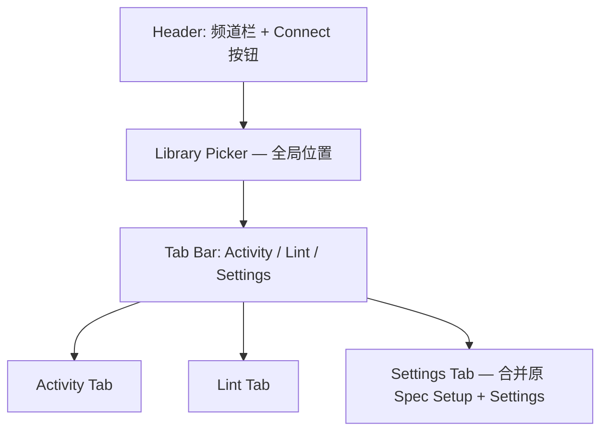

# 设计文档：Plugin Panel UX 改版

## 概述

本设计文档描述 FigCraft 插件面板（`src/plugin/ui.html`）的全面 UX/UI 改版方案。改版涵盖信息架构重构、视觉层级修正、WCAG AA 合规、8dp 间距修正、交互反馈一致性、错误处理优化、响应式布局和无障碍标记等方面。

所有变更集中在单一文件 `src/plugin/ui.html`（HTML + CSS + JS），需同时支持浅色/深色主题和 EN/中文两种语言。

### 设计决策与理由

1. **单文件架构保持不变**：Figma 插件 UI 要求所有代码在一个 HTML 文件中，因此不拆分文件。
2. **渐进式改造**：在现有代码基础上修改，而非重写，以降低回归风险。
3. **CSS 自定义属性驱动主题**：继续使用 `:root` CSS 变量方案，仅调整色值以满足对比度要求。
4. **8dp 网格严格执行**：所有间距值对齐到 2 的倍数，优先使用 4 的倍数。

## 架构

### 当前架构

```
ui.html
├── <style>        — CSS 自定义属性 + 组件样式
├── <body>         — HTML 结构（Header → Tab Bar → Tab Panes）
└── <script>       — 状态管理 + WebSocket + DOM 操作 + i18n
```

### 改版后架构

整体架构不变，但内部结构调整如下：



### 关键架构变更

1. **Library Picker 提升**：从 Spec Setup 标签内移至 Header 下方，成为全局组件
2. **标签合并**：原 4 个标签（Activity / Lint / Spec Setup / Settings）→ 3 个标签（Activity / Lint / Settings）
3. **Settings 标签整合**：将 Mode 切换、API Token 配置、Library 管理（原 Spec Setup 内容）与语言选择、连接信息（原 Settings 内容）合并

## 组件与接口

### 1. Header 区域

```
┌─────────────────────────────────┐
│ Channel                         │
│ [channel-input] [Connect ● ]    │
│ [Library Picker ▾             ] │  ← 新位置
└─────────────────────────────────┘
```

- **Connect 按钮**：改为中性边框样式 + 状态圆点（所有状态）
- **Library Picker**：从 Spec Setup 移至此处，Spec 模式下隐藏

### 2. Tab Bar

```html
<div class="tab-bar" role="tablist">
  <button role="tab" aria-selected="true" aria-controls="panel-activity" 
          id="tab-activity" type="button">Activity</button>
  <button role="tab" aria-selected="false" aria-controls="panel-lint" 
          id="tab-lint" type="button">Lint</button>
  <button role="tab" aria-selected="false" aria-controls="panel-settings" 
          id="tab-settings" type="button">Settings</button>
</div>
```

### 3. Settings Tab（合并后）

```
┌─────────────────────────────────┐
│ MODE                            │
│ [Library] [Spec]                │
│ 描述文本...                      │
├─────────────────────────────────┤
│ API TOKEN                       │
│ [figd_xxx        ] [Save]       │
│ hint text                       │
├─────────────────────────────────┤
│ LANGUAGE                        │
│ [EN] [中文]                      │
├─────────────────────────────────┤
│ QUICK START                     │
│ 1. 2. 3. ...                    │
├─────────────────────────────────┤
│ MCP CONFIG                      │
│ { ... }              [Copy]     │
├─────────────────────────────────┤
│ CONNECTION INFO                 │
│ Status: ...  Port: ...          │
└─────────────────────────────────┘
```

### 4. 交互反馈组件

| 组件 | 反馈方式 | 说明 |
|------|---------|------|
| Token Save | 淡入/淡出 "Saved" | 持续 ≥1.5s，使用 CSS transition |
| Run Lint | spinner 动画 | 与 Library 添加按钮一致的旋转动画 |
| Auto Fix (disabled) | `title` 提示 | 说明禁用原因 |
| Run Lint (未连接) | 面板内错误提示 | 替代仅在日志中输出 |

### 5. 错误处理组件

| 场景 | 处理方式 |
|------|---------|
| Library URL 错误 | 5 秒后自动消失（setTimeout） |
| 所有端口不可用 | 用户友好消息 + 排查建议 |
| 连接失败 | 错误信息 + 可操作建议 |

## 数据模型

### CSS 颜色 Token 体系

#### 浅色主题（Light）

| Token | 当前值 | 新值 | 对比度（vs #ffffff） |
|-------|--------|------|---------------------|
| `--text-primary` | `#333333` | `#333333`（不变） | 12.63:1 ✓ |
| `--text-secondary` | `#888888` | `#595959` | 7.05:1 ✓ |
| `--text-tertiary` | `#aaaaaa` | `#767676` | 4.54:1 ✓ |
| `--warning` | `#ffcd29` | `#ffcd29`（不变） | — |

#### 深色主题（Dark）

| Token | 当前值 | 新值 | 对比度（vs #2c2c2c） |
|-------|--------|------|---------------------|
| `--text-primary` | `#e8e8e8` | `#e8e8e8`（不变） | 12.28:1 ✓ |
| `--text-secondary` | `#999999` | `#a3a3a3` | 5.09:1 ✓ |
| `--text-tertiary` | `#777777` | `#8b8b8b` | 4.52:1 ✓ |

#### Lint Score Circle — Warn 状态

- 背景色 `--warning: #ffcd29`，前景文本需 ≥4.5:1 对比度
- 当前：`color: var(--text-primary)` → 浅色主题 `#333333` vs `#ffcd29` = 2.82:1 ✗
- 修正：warn 状态固定使用 `color: #1a1a00`（对比度 ≈ 12.5:1 vs `#ffcd29`）

#### Connect 按钮样式

| 状态 | 当前样式 | 新样式 |
|------|---------|--------|
| disconnected | 实心蓝色 `background: var(--accent)` | 透明背景 + 边框 + 红色状态圆点 |
| connected | 透明 + 绿色文字 | 透明背景 + 边框 + 绿色状态圆点 |
| connecting | 透明 + 灰色文字 | 透明背景 + 边框 + 黄色脉冲圆点 |

### 8dp 间距修正清单

| 选择器 | 属性 | 当前值 | 修正值 |
|--------|------|--------|--------|
| `.setting-desc` | `margin-top` | `-2px` | `0` |
| `.log-entry` | `padding` | `1px 0` | `2px 0` |
| `.log-entry` | `margin-bottom` | `1px` | `2px` |
| `.library-popup` | `gap` | `1px` | `2px` |
| `.library-popup-add-row .input` | `height` | `28px` | `32px` |
| `.library-popup-add-btn` | `height/width` | `28px` | `32px` |

### Mode Indicator 样式

| 属性 | 当前值 | 新值 |
|------|--------|------|
| `color` | `var(--accent)` | `var(--text-secondary)` |
| `background` | `var(--accent-bg)` | `var(--surface)` |
| `font-weight` | `600` | `500` |

### ARIA 标记模型

```
tablist
├── tab#tab-activity  [aria-controls="panel-activity", aria-selected]
├── tab#tab-lint      [aria-controls="panel-lint", aria-selected]
└── tab#tab-settings  [aria-controls="panel-settings", aria-selected]

tabpanel#panel-activity  [aria-labelledby="tab-activity"]
tabpanel#panel-lint      [aria-labelledby="tab-lint"]
tabpanel#panel-settings  [aria-labelledby="tab-settings"]
```

### i18n 数据模型变更

需要新增/修改的翻译键：

| 键 | EN | 中文 |
|----|-----|------|
| `error.relay.unavailable` | `Cannot connect to relay. Make sure your IDE has FigCraft running.` | `无法连接到中继服务，请确认 IDE 已启动 FigCraft。` |
| `error.relay.suggestion` | `Try restarting your IDE or check if another process is using the port.` | `请尝试重启 IDE，或检查端口是否被其他进程占用。` |
| `error.notconnected.lint` | `Connect to relay first to run lint checks.` | `请先连接中继服务后再运行检查。` |
| `lint.autofix.disabled.noviolations` | `No fixable violations found` | `没有可自动修复的违规项` |
| `lint.autofix.disabled.notconnected` | `Connect to relay first` | `请先连接中继服务` |

### JS 代码质量模型

| 变更 | 说明 |
|------|------|
| `var` → `let`/`const` | 所有顶层和函数内 `var` 声明替换为 `let`（可重赋值）或 `const`（不可重赋值） |
| 主题检测防抖 | `MutationObserver` 回调包裹 debounce（150ms），避免连续触发导致闪烁 |
| 清除日志后 i18n 同步 | `logClearBtn` 事件中重建的空状态元素需调用 `applyLocale()` 或直接使用 `t()` |

